借助现有的权限管理和持久化数据的功能，`lazy mock`可以作为demo的后端服务支持，甚至可以做为一个博客的后台系统部署到服务器上。

## 部署

以[daocloud](https://dashboard.daocloud.io)+docker部署为例

### 创建项目

`daocloud`支持多个流行git仓库，也可以使用你自己的git仓库地址

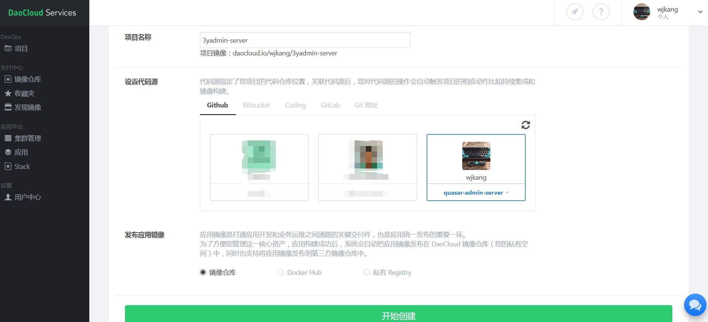

### 流程定义

编辑那刚才创建的项目，将默认测试任务删除

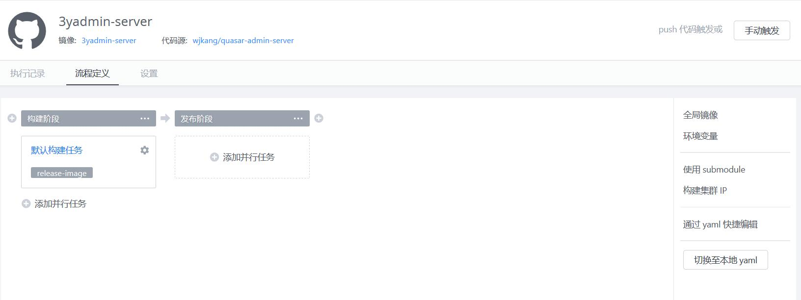

### 构建镜像

项目右边才做菜单，选择“手动构建”，然后选择要构建的分支

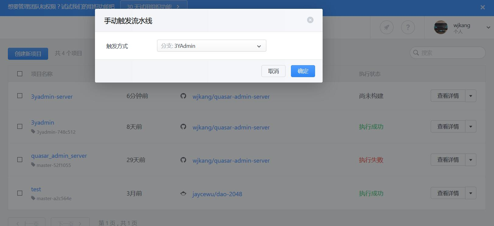

成功后到镜像仓库就可以看到新构建的镜像

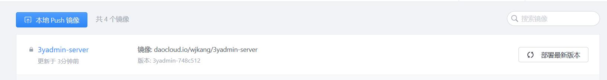

### 部署应用

点击“部署最新版本”

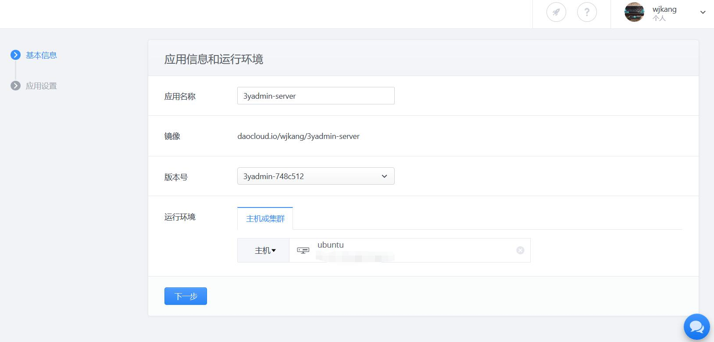

填写应用名称，选择镜像版本以及主机(如何配置主机，可以看`daocloud`的文档，那里会更加详细)

点击下一步，继续配置

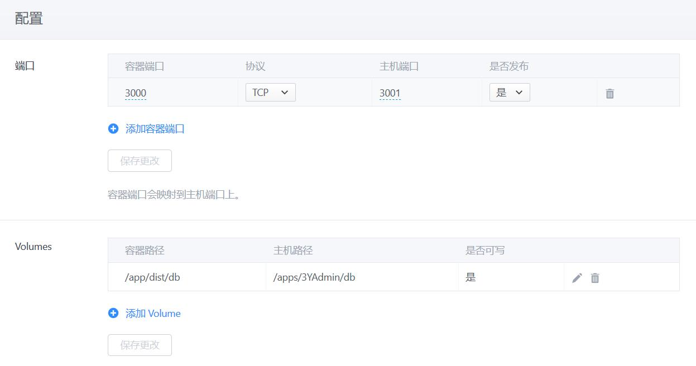

然后点部署即可

最后还要将项目`src/db`下所有文件拷贝到上面配置的云主机的路径下（`/apps/3YAdmin/db`）

以下是我成功部署的两个应用

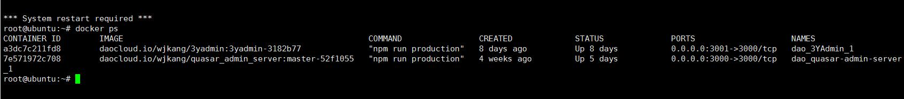

### 持续集成

回到流程定义界面，设置“默认构建任务”，设置触发条件

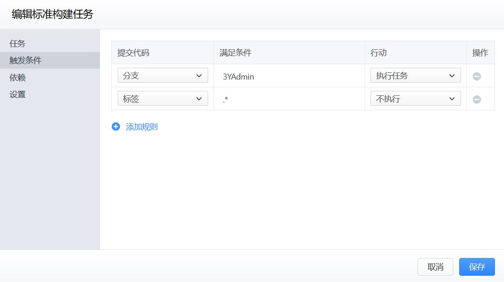

点击“发布阶段”的“添加并行任务”

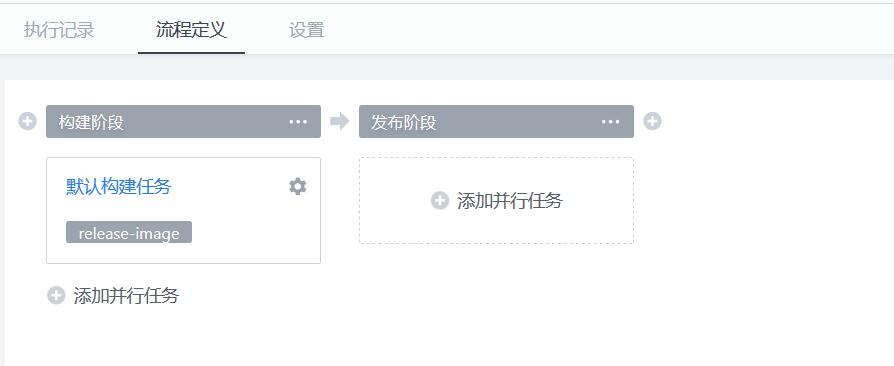

选择发布到自有主机，然后选择之前创建的应用

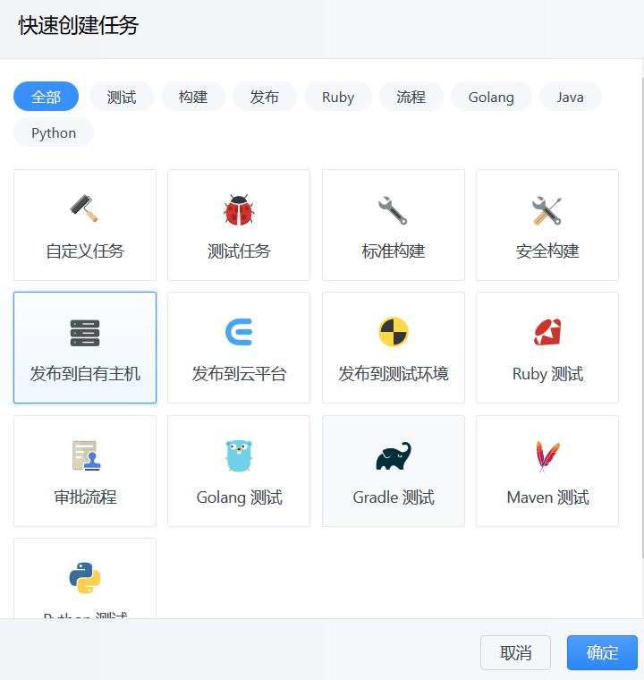


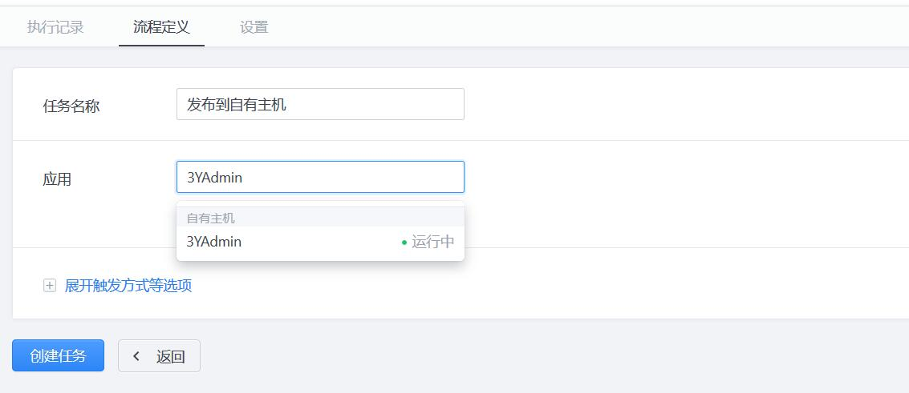

最后点击创建任务。以后每当相应的分支提交了代码，会自动构建镜像，并且以最新镜像部署应用

>需要手动删除云主机上的旧的镜像，避免占用磁盘空间


## 其它接口

以生产环境的方式部署后，用户的访问记录会记录在`request_log_db.json`文件中。

查看的接口是
```js
request({
    url: '/requestlog/pagedlist',
    method: 'get',
    params: {
        pageIndex: 1,
        pageSize: 10,
        sortBy: 'createdDate',
        descending: true
    }
})
```

如果是将应用作为demo后端服务部署，可能有时候需要将应用的数据重置为最开始部署的样子。对应的接口为
```js
request({
    url: '/resetdb',
    method: 'post'
})
```
其实就是将`db_backup.json`的内容覆盖到`db.json`里。如果其他的实体的db.json文件也需如此，可按照代码自行添加

